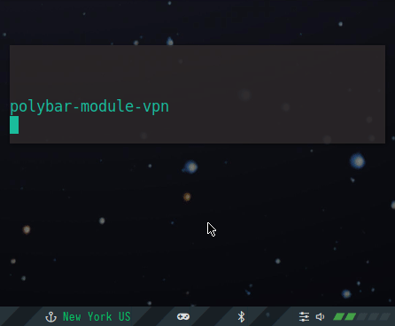

# polybar-vpn-controller

Manage your VPN via this polybar module. The module reports the VPN's status in one of three states: `[<location> | connecting... | No VPN ]`, where the location is your public IP address. With optional dependencies, `<location>` is replaced with `<city> <country>`.
- left-click: to connect and disconnect
- right-click: optional rofi menu to select between locations
- middle-click: copy your public IP address to the clipboard



###### (The polybar theme seen in the gif was modified from polybar-5 provided by [Aditya Shakya](https://github.com/adi1090x/polybar-themes) and originally designed by [Benedikt Vollmerhaus](https://gitlab.com/BVollmerhaus))

## supported VPNs
polybar-vpn-controller is scripted to facilitate differing VPN's, but compatibility will depend on your VPN's API. **The stock settings are intended for use with [Mullvad VPN](https://mullvad.net).** See the `vpn_module.sh` script user settings to judge whether this code can easily be adapted for your choice of VPN.

It'd be great to make this module more robust for other VPN's, so please contribute other setups. Thanks!

## dependencies
You need a VPN! 
- `mullvad-vpn`, available in the [AUR](https://aur.archlinux.org/packages/mullvad-vpn/)
- or your own VPN (requires reconfiguring `vpn_module.sh`)

### optional dependencies
- `rofi` 				  - menu-based control of the VPN
- `geoip` and `geoip-database` - provide country info instead of public IP address
- `geoip-database-extra`  - also provides city info
- `xclip`                 - allows copying ip address to clipboard

The optional dependencies can be found in the [Arch Package Repository](https://www.archlinux.org/packages/).

## install

This setup assumes that your `polybar` configuration is at `~/.config/polybar`. To setup a VPN other than Mullvad, read the configuration tips in `vpn_module.sh`. Modify as necessary.

```
cd ~/.config/polybar
git clone https://github.com/shervinsahba/polybar-vpn-controller.git
cd polybar-vpn-controller
mkdir -p ~/.local/share/fonts
cp fonts/* ~/.local/share/fonts/
cat vpn_user_module >> $HOME/.config/polybar/user_modules.ini
```

After installation add the `vpn` module to your `config.ini` polybar.


## known issues

The Mullvad VPN client may create excessive entries in the system journal because of the way this script calls on it. To suppress these messages in your log, follow [these instructions](https://github.com/shervinsahba/polybar-vpn-controller/issues/6#issuecomment-669652829) for a distro with `systemd`. Tested on Manjaro and Arch.
