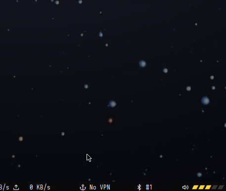

# polybar-module-mullvad
polybar module for mullvad vpn 
by Shervin S. (shervin@tuta.io)

The mullvad_module reports mullvad's status in one of three states: `[<ip_address> | connecting... | No VPN ]`, where the IP address is your public IP given after connecting to Mullvad. With optional dependencies, `<ip_address>` will be replaced with `<city> <country>`. You can also connect and disconnect via left-clicks, or with rofi, right-click to access a menu and select between your favorite locations, set in VPN_LOCATIONS, as well as 35 countries.



## dependencies:
- `mullvad-vpn` (or `mullvad-vpn-cli`)

Mullvad is available in the [AUR](https://aur.archlinux.org/packages/mullvad-vpn/).

## optional dependencies: 
- `rofi` 				  - allows menu-based control of mullvad
- `geoip` and `geoip-database` - together provide country info instead of public address
- `geoip-database-extra`  - also provides city info

The optional dependencies can be found in the [Arch Package Repository](https://www.archlinux.org/packages/).

## polybar module

The `mullvad_user_module` assumes that `polybar` is installed at `~/.config/polybar`. Modify as necessary.
```
[module/mullvad]
type = custom/script
exec = $HOME/.config/polybar/scripts/mullvad_module.sh
click-left = $HOME/.config/polybar/scripts/mullvad_module.sh --toggle-connection &
click-right = $HOME/.config/polybar/scripts/mullvad_module.sh --location-menu &
interval = 5
format =  <label>
format-background = ${color.mb}
```

## install

Please review the installation, and modify as needed prior to install.

```
git clone https://github.com/shervinsahba/polybar-module-mullvad.git
cd polybar-module-mullvad
cp fonts/* $HOME/.local/share/fonts/
cp mullvad_module.sh $HOME/.config/polybar/scripts/
cat mullvad_user_module >> $HOME/.config/polybar/user_modules.ini
